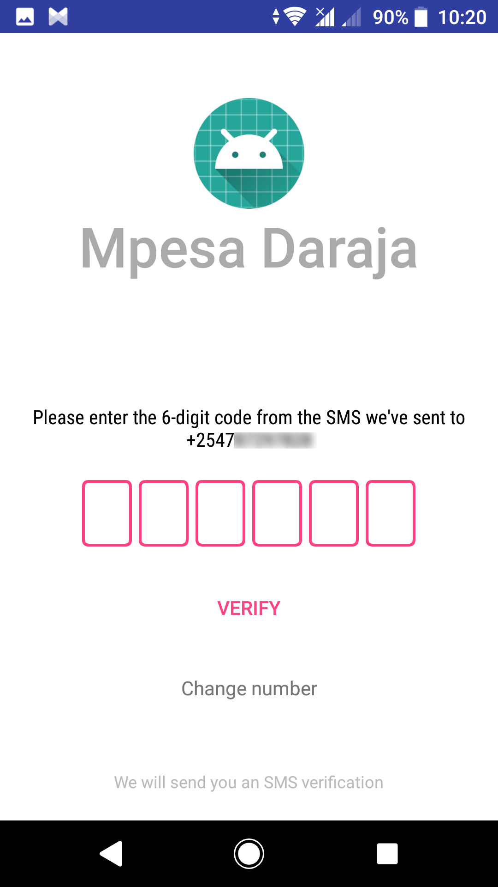
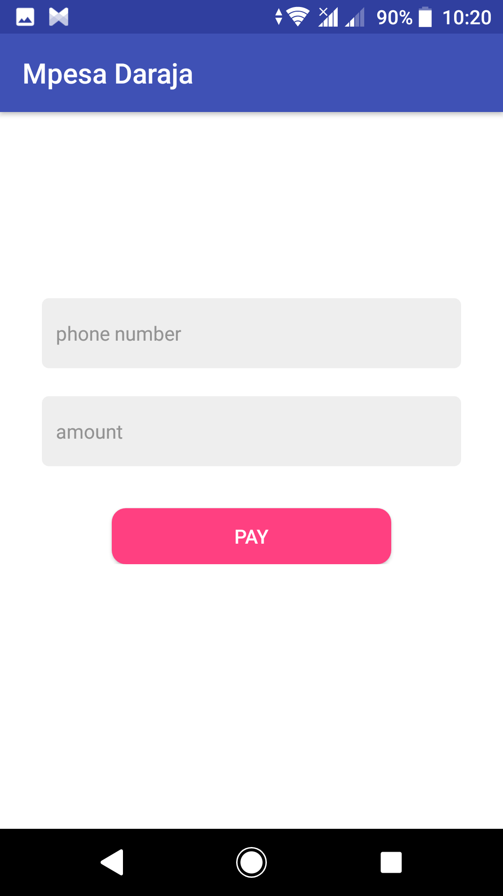

# Mpesa Daraja
This is a  sample android application to test Safaricom M-Pesa STK push using Twiga Engineering (https://github.com/twigaeng) android-daraja-sdk library (https://github.com/twigaeng/android-daraja-sdk)

## Requirements
* Android Studio
* Kotlin
* Kotlin anko

## Getting Safaricom credentials
1. Create a developer account on the Safaricom Developer Portal (https://developer.safaricom.co.ke/)
2. Create a Lipa na M-Pesa online app on the console 
3. Go to https://developer.safaricom.co.ke/test_credentials to get test credentials for transactions

## Project setup
1. On your android studio start screen, go to 'Check out from version control'
2. Paste the clone link (https://github.com/tirgei/MpesaDaraja.git) then press clone
3. Open the project

#### Firebase setup
You'll need to setup firebase which in this case will be used for authentication. We'll later use firebase to send confirmation notifications using Firebase functions once a transaction is successful.

1. On your android studio, click on 'Tools' from the menu bar then Firebase.
2. A firebase assistant pane will open from the right.
3. Click on 'Authentication' then connect to firebase, the authentication dependency will be added

You can check the firebase functions repo here: https://github.com/tirgei/mpesa-daraja-functions

## Getting started
Create a Kotlin object named 'Constants' to hold the variables.

From the Safaricom test credentials page:
  - PAYBILL (Lipa na M-Pesa Online Shortcode)
  - PASSKEY (Lipa na M-Pesa Online Passkey)
  - ACCOUNT_REF (Initiator name)
    
From the app you created in your developer console:
  - CONSUMER_KEY
  - CONSUMER_SECRET

You're now all set to tinker around, Happy Coding :)

## Screenshots
 
 
 
 

### Libraries used
1. Daraja - https://github.com/twigaeng/android-daraja-sdk
2. Mikepenz Iconics (FontAwesome) - https://github.com/mikepenz/Android-Iconics
3. PinView - https://github.com/ChaosLeong/PinView
